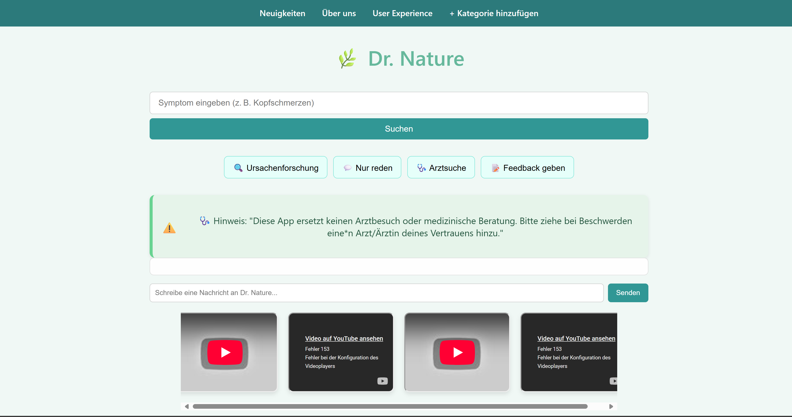
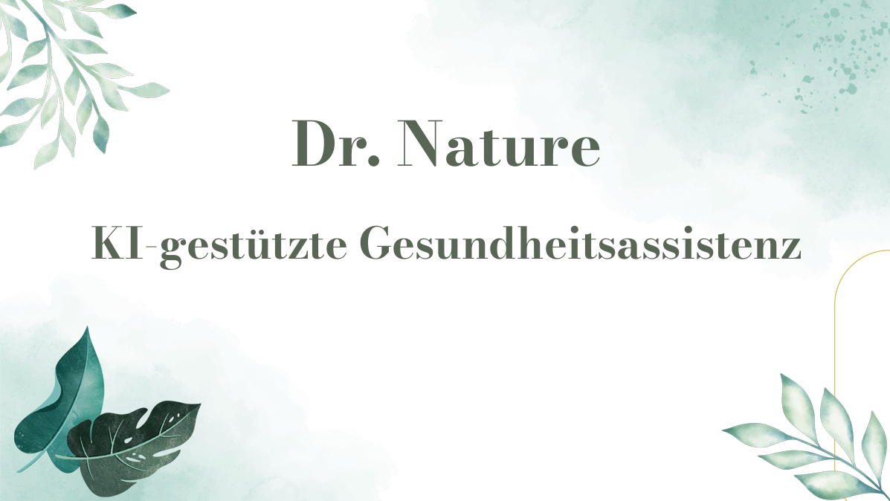
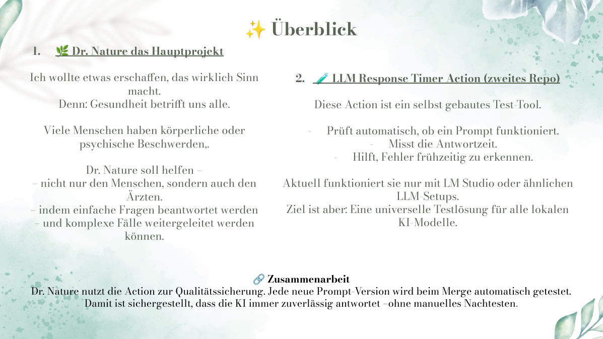
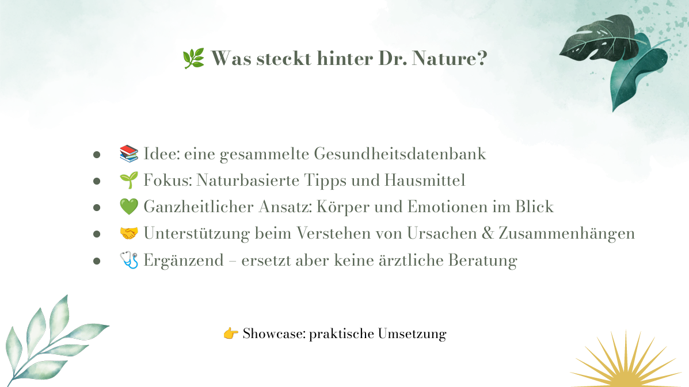
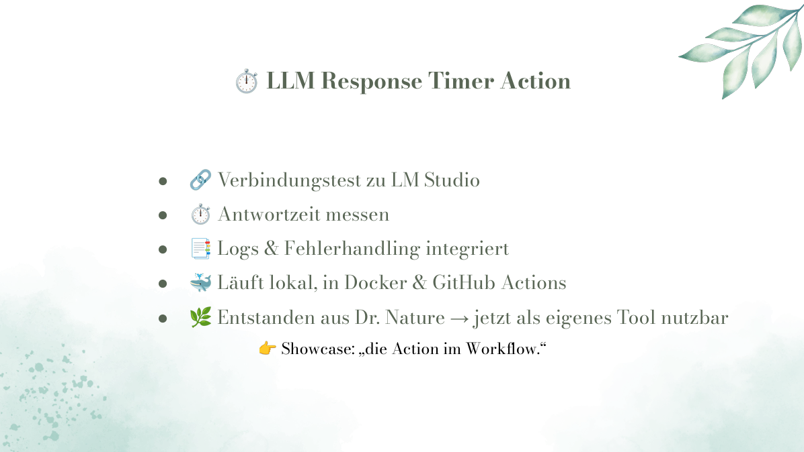
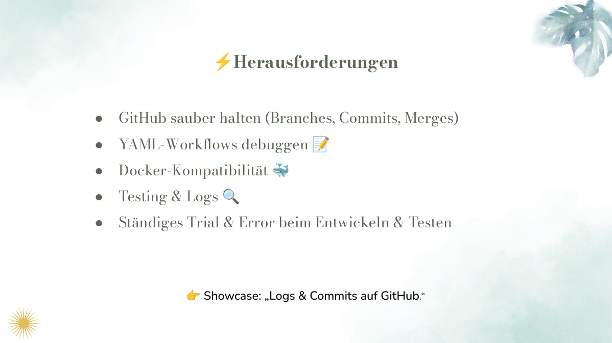
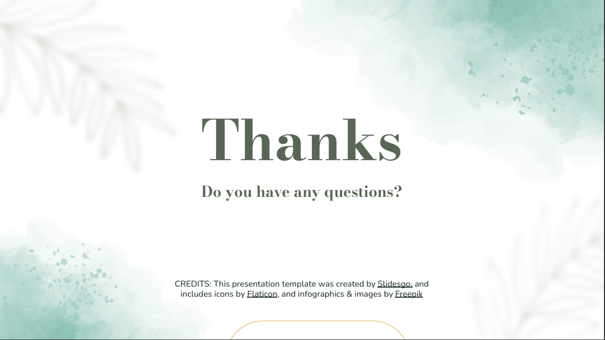

➡️ Zur deutschen Version: [README_de.md](README_de.md)

# 🌿 Dr. Nature – AI Assistant Web Application for LLM Experimentation and Local Deployment

**Tech Stack:**  
Python · Flask · HTML/CSS/JS · JSON · Local LLM APIs (LM Studio)

---

## Project Context

Dr. Nature is a long-term project currently under active development.

The project originated during a professional training program and was presented there as a final project.  
The training has since been completed and development continues.

During development an additional tool was created: LLM Response Timer Action.

This tool measures response times of language models, logs model outputs, and tests API requests.

**Repository:**  
LLM Response Timer Action  
https://github.com/Margarethe-S/llm-response-timer-action

---

## 🧠 Project Overview

Dr. Nature is a web application for an AI assistant used through a chat interface.

The current focus is a health-oriented AI assistant communicating with language models through a web frontend.

The application combines:
- Web chat interface
- Flask backend for API communication
- Model integration via local or API-based LLM endpoints
- Modular prompt system
- Local testing and logging environment
- Prepared JSON-based memory structure

Model connections are currently handled via configurable API endpoints, for example LM Studio.

This allows different local or external model servers to be tested.

The project serves both as an application prototype and an experimentation platform for local LLM systems.

---

## 🧱 Architecture Overview

The application consists of three main components:

User Interface  
↓  
Flask Backend API  
↓  
LLM Runtime / Model Server

>Request flow:
>1. User sends a request via the web interface
>2. The frontend forwards the request to the Flask backend
>3. The backend loads the selected system prompt
>4. The request is forwarded to the configured language model
>5. The model response is processed and returned to the frontend
>6. Optional local logging is created

This modular architecture allows swapping different model servers.

---

## 🔌 Flexible Model Integration

- supports local LLMs (e.g. LM Studio)
- open to external APIs (for future testing)
- API is controlled via an endpoint URL

The architecture is designed to:
- support hybrid systems (local + cloud)
- allow easier model switching
- enable experimental LLM testing without changing the code

---

## 🚧 Current Development

Dr. Nature is under active development.

Current focus:
- Stable local runtime
- Integration of locally running language models
- Developer mode for testing and debugging
- Online/offline operation
- Long-term memory strategy for conversation data
- Potential integration of local maps and emergency information

Long-term goal: a locally installable desktop version.

---

## 🎓 Final Project (Training Stage)

The version presented during training already included:
- Web chat interface
- Flask backend communication
- LM Studio API integration
- Model configuration via environment variables
- Local prompt management
- Logging and timing tests
- Model response testing environment
- Prepared JSON memory structure

Tested models:
- Mistral 7B 
- LLaMA3
- OpenHermes

Most recently used model:
- EM German Mistral v01

---

## 💻 Web Interface

---

## 📊 Project Presentation

### Slide 1

### Slide 2

### Slide 3

### Slide 4

### Slide 5

### Slide 6

>📄 View Full Presentation (PDF)  
[Open presentation slides](./docs/Präsentation.pdf)

---

## 🔎 Logging & Testing

Dr. Nature creates local log files for model tests.

Directory:

>logs/

Example:

>logs/log_2025-09-28.txt

Logs include:
- Request status
- Timestamps
- Response duration
- Used prompt file
- Model response

Logging is handled via the test interface (logger.py).

---

## 🧠 Memory

Dr. Nature currently uses two memory approaches:

- Test mode (JSON-based): stores user conversations per user (for testing, logging, and debugging)
- Web application: limited server-side conversation history within a session

The memory system is currently being expanded.

---

## 🧪 Test Mode (LLM Connection Test)

In addition to the web application, the project includes a separate test interface for direct model testing.

Start:
python test_interface/test_lm_connection.py

Features:
- sends a test request to the configured LLM
- loads the defined system prompt
- measures response time
- shows a live stopwatch
- provides acoustic feedback (beep)
- saves logs locally
- stores conversation in the memory system

This tool is used for:
- debugging API connections
- testing prompts
- measuring performance (response time)
- validating model behavior independently from the frontend

---

## 🧩 System Prompts & Modes

System prompts are located in:

>system_prompt/

Example:

>system_prompt/core_mode.txt

Available modes:
- Core Mode
- Root Mode
- Talk Mode

---

## 📁 Project Structure

.github/workflows/ – GitHub Actions & tests  
app/ – Application components  
backend/ – Flask API & model communication  
frontend/ – Web interface  
dev/ – Development tools  
logs/ – Runtime logs  
models/ – Model related files  
private/ – Local development data  
progress_logs/ – Development documentation  
runtime/ – Runtime components  
system_prompt/ – Prompt files  
test_interface/ – Model testing & logging  

---

## ⚙️ Operating Modes (Runtime vs Test)

The project distinguishes between two main modes:

1. Runtime (Web Application)
- started via: backend/server.py
- used through the browser (frontend)
- focus: user interaction

2. Test Mode (Developer Tool)
- started via: test_interface/test_lm_connection.py
- used in the console
- focus: debugging, logging, performance

This separation helps keep the application stable while allowing independent testing and development.

---

## ⚡ Quick Start

1. Clone repository

>git clone https://github.com/Margarethe-S/dr-nature

2. Open project directory

>cd dr-nature

3. Create virtual environment

>python -m venv .venv

4. Activate

>Windows  
.venv\Scripts\Activate.ps1

>Linux/macOS  
source .venv/bin/activate

5. Install dependencies

>pip install -r requirements.txt

6. Run backend

>python backend/server.py

7. Open Frontend

The frontend can be opened directly in the browser:

>Option 1 (simple):
- Open the file:
  frontend/index.html

> Option 2 (recommended):
- Start a Live Server (e.g. VS Code extension "Live Server")

The frontend automatically connects to the running Flask backend.

---

## 🛠 Installation

Linux/macOS

>python -m venv .venv  
source .venv/bin/activate

Windows

>python -m venv .venv  
.venv\Scripts\Activate.ps1

pip install -r requirements.txt

---

## 🚀 Planned Features

- UI/UX improvements
- voice input & output
- online/offline mode
- extended memory handling
- map & location features
- optional web search

---

## 📈 Development Status

This project is under active development.

Current focus:
- Local model integration
- Expanding the test system
- Improving the prompt structure
- Preparing a local runtime

---

## ⚠️ Disclaimer

Dr. Nature is an experimental development project.

The system does not provide medical advice and does not replace consultation with a licensed medical professional.

---

## 🛡 License

This repository is provided for learning and development.

You may fork or modify the project under the terms of the license.

If you redistribute or publicly use the software, you must disclose your modifications.

License: GNU Affero General Public License v3.0 (AGPL-3.0)

See the LICENSE file for details.
